# SSRSSetupTroubleshooting
## Prerequisites

## Server

Latest Compatible Windows Server

## Applications

Download and Install SQL Server 2017 from [https://www.microsoft.com/en-us/sql-server/sql-server-downloads](https://www.microsoft.com/en-us/sql-server/sql-server-downloads)

Download and Install SQL Server Reporting Services from [https://www.microsoft.com/en-us/download/details.aspx?id=55252](https://www.microsoft.com/en-us/download/details.aspx?id=55252)

Download and Install SQL Server Tools from [https://docs.microsoft.com/en-us/sql/ssms/download-sql-server-management-studio-ssms?view=sql-server-2017](https://docs.microsoft.com/en-us/sql/ssms/download-sql-server-management-studio-ssms?view=sql-server-2017)

All of the above can also be downloaded and installed using SSDT from [https://docs.microsoft.com/en-us/sql/ssdt/download-sql-server-data-tools-ssdt?view=sql-server-2017#ssdt-for-vs-2017-standalone-installer](https://docs.microsoft.com/en-us/sql/ssdt/download-sql-server-data-tools-ssdt?view=sql-server-2017#ssdt-for-vs-2017-standalone-installer)

## Configuration

### Open Report Server Configuration Manager

#### Service Account

Choose the built in account or use managed service account.

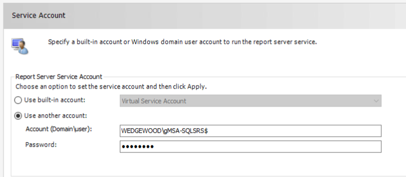

### Web Service URL

By default, port 80 should get configured and port 443 can be configured if needed in the Advanced… settings.

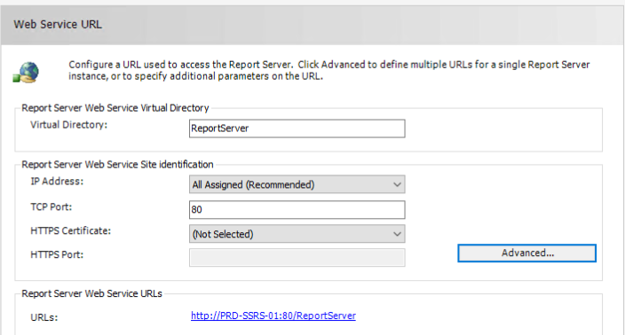

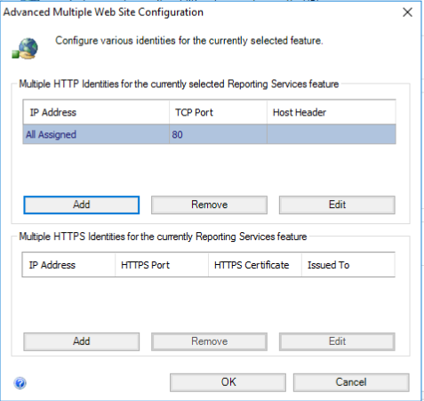

### Database

#### Report Server needs databases

Default naming convention as follow: ReportServer and ReportServerTempDB

Choose the built in account or use managed service account.

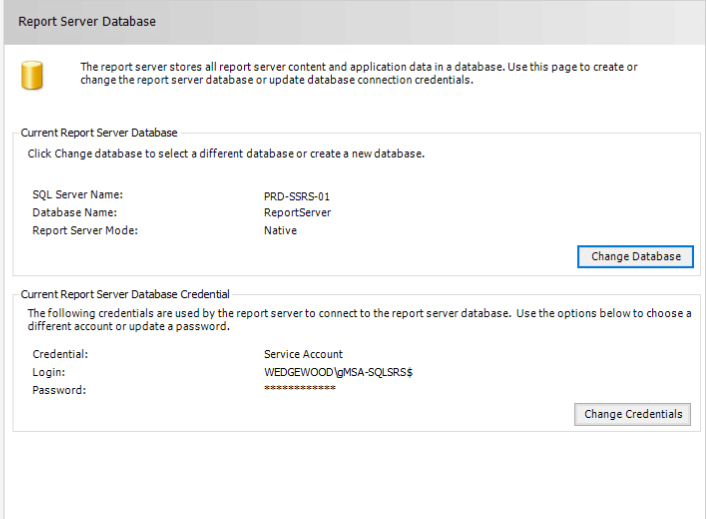

 
#### Click on &#39;Change Database&#39;

Create a new report server database
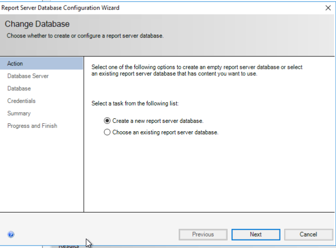

Connect to the SQL server instance
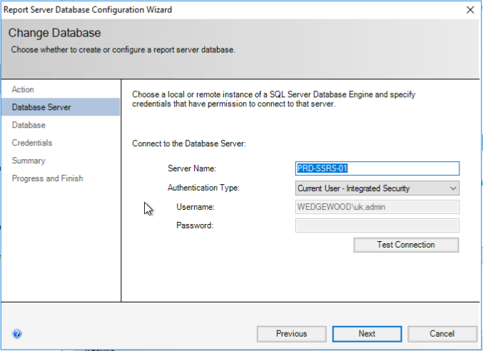

Name the DB

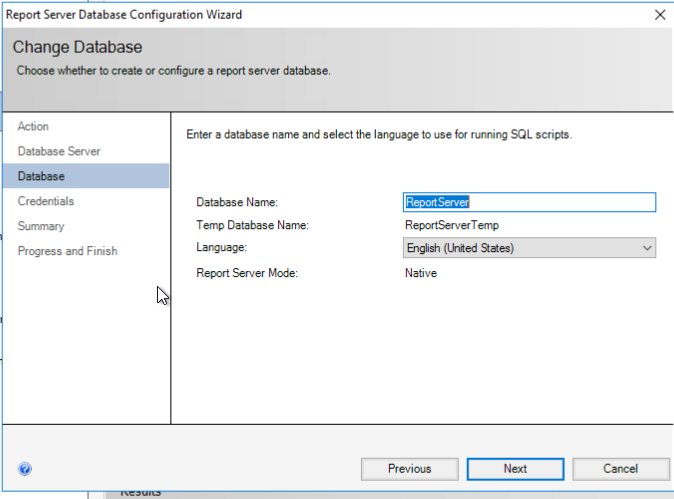

Finish

### Web Portal URL

Virtual Directory: Reports

By default, URL should be the server name /Virtual Directory

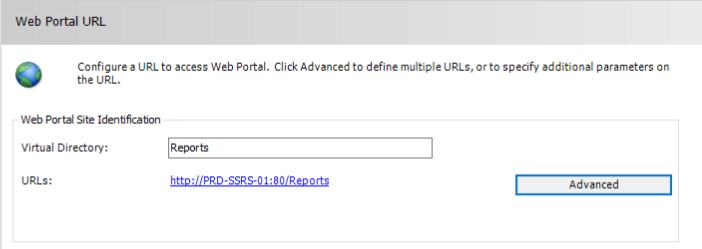

### Email Settings

Configure as needed

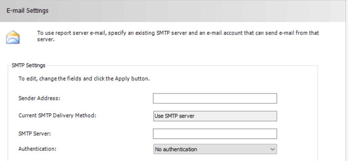

### Execution Account

Configure as needed

[https://docs.microsoft.com/en-us/sql/sql-server/install/execution-account-ssrs-native-mode?view=sql-server-2014&amp;viewFallbackFrom=sql-server-2017](https://docs.microsoft.com/en-us/sql/sql-server/install/execution-account-ssrs-native-mode?view=sql-server-2014&amp;viewFallbackFrom=sql-server-2017)

### Encryption Keys

Use only when need to backup/restore/migrate

### Subscription Settings

Configure as needed. Use managed service account to authenticate for file share.

### Scale-out Deployment

Configure as needed.

### Power BI Service (cloud)

Configure as needed

## Backup/Restore – Migration Process

### Backup

#### Encryption Keys Backup

Open Reporting Server Configuration Manager on the current server

Go to Encryption Keys

Click on Backup

Select File Location and set a password (required)

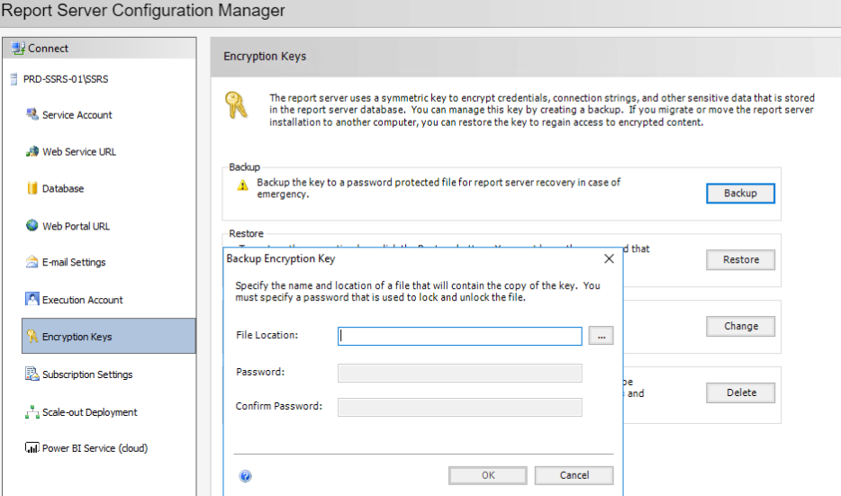

#### Report Server Backup

Login on current server

Make sure on the server following drive and folder exist

`D:\Backup\`

Run the following script on command line as an administrator

`SqlCmd -S currentservername -Q "BACKUP DATABASE [ReportServer] TO DISK='D:\Backup\ReportServer.bak'"`

`SqlCmd -S currentservername -Q "BACKUP DATABASE [ReportServerTempDB] TO DISK='D:\Backup\ReportServer.bak'"`

### Restore

#### Report Server Restore

Login to new server

Copy the backup files from current server onto the new server

Make sure `D:\Data\` and `L:\Logs\` drives and folders exists

Run the following script on command line as an administrator

`SqlCmd -S "newserver" -Q "ALTER DATABASE [ReportServer] SET SINGLE_USER WITH ROLLBACK IMMEDIATE; DROP DATABASE IF EXISTS [ReportServer];"`   

`SqlCmd -S "newserver" -Q "RESTORE DATABASE [ReportServer] FROM   DISK = N'D:\Backup\ReportServer.bak';  WITH MOVE 'ReportServer' TO 'D:\Data\ReportServer.mdf',  MOVE 'ReportServer_log' TO 'L:\Logs\ReportServer\_log.LDF',  NORECOVERY, REPLACE;"`

`SqlCmd -S "newserver" -Q "ALTER DATABASE [ReportServerTempDB] SET SINGLE_USER WITH ROLLBACK IMMEDIATE; DROP DATABASE IF EXISTS [ReportServerTempDB];"`   

`SqlCmd -S "newserver" -Q "RESTORE DATABASE [ReportServerTempDB] FROM   DISK = N'D:\Backup\ReportServerTempDB.bak';  WITH MOVE 'ReportServerTempDB' TO 'D:\Data\ReportServerTempDB.mdf',  MOVE 'ReportServerTempDB_log' TO 'L:\Logs\ReportServerTempDB\_log.LDF',  NORECOVERY, REPLACE;"`

#### Encryption Keys Restore

Open Reporting Server Configuration Manager on the current server

Go to Encryption Keys

Click on Restore

Select File Location and enter the password (required)

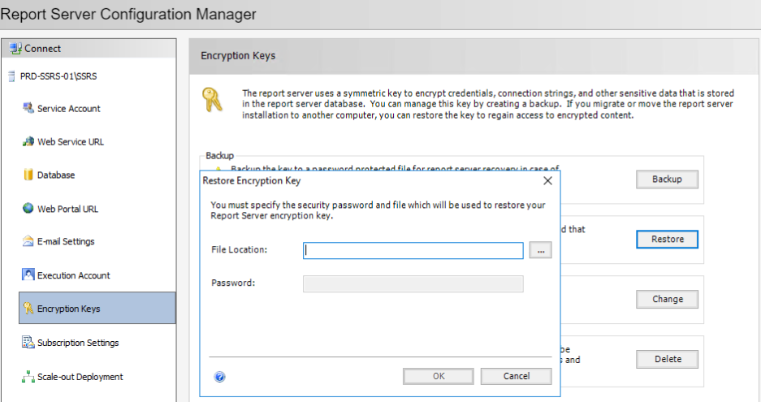

## Changing from Local Accounts to Group Managed Service Account

Create gMSA using Powershell script

`New-ADServiceAccount accountname -DNSHostName groupNamefortheAccount –PrincipalsAllowedToDelegateToAccount "CN=accountname,CN=folder,DC=parentfolder"`

 (security group must be created)

Add the computer in the security group for authentication

Restart the computer

Test the service account

 `Test-ADServiceAccount accountname` (true - success)

Open Services

Select SSRS

Change the from the local account to the gMSA

Restart the service
